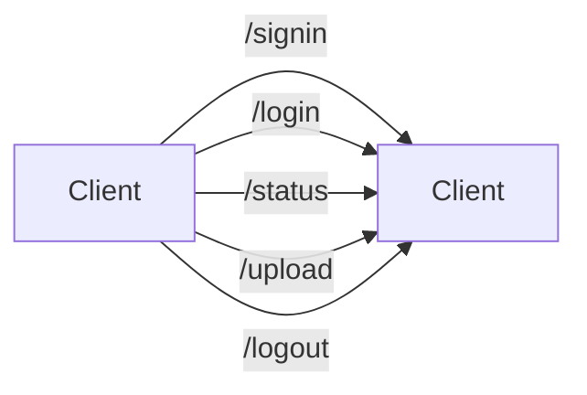

# Architecture
Karla Sofía González Rodríguez 0214774
Saúl Eduardo Zepeda de la Torre 0214016

## Functions

- **GenerateToken**: receive an integer (length of token), generates a random token.
- **ValidateUsername**: receive a string (actual username), search the user in the database.
-  **ValidatePassword**: receive two strings (actual username and actual password), validate the password with their username.
- **Main**: Endpoints are declared and the API runs.

## Diagram

> We include a new endpoint "signin" to create users with their passwords
